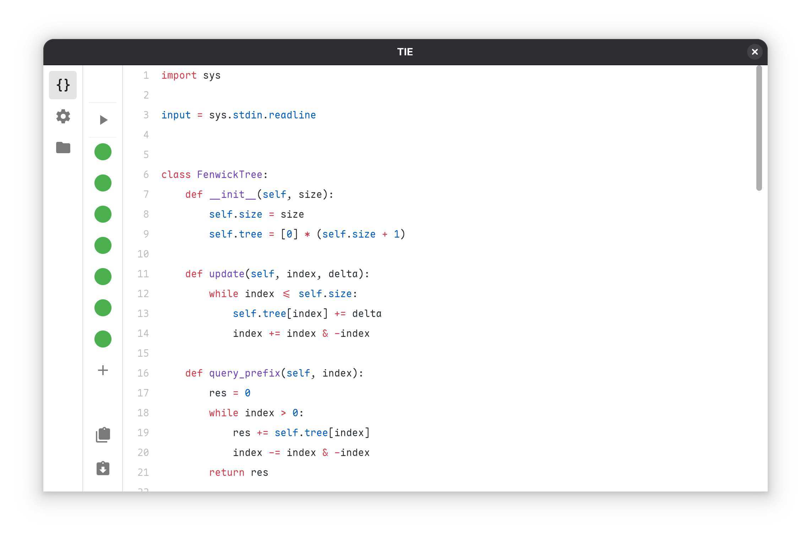
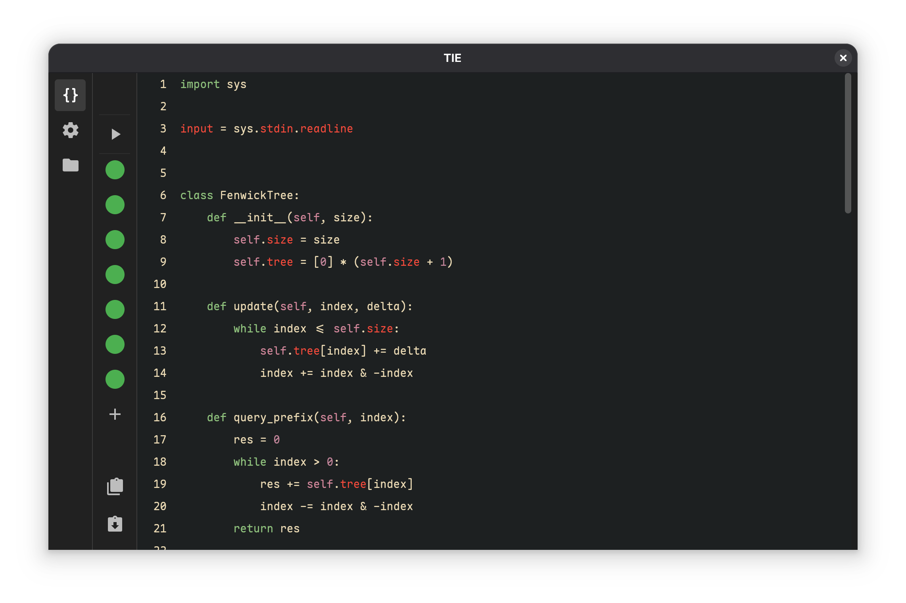

en-US | [zh-Hans](./docs/README_zh-Hans.md)

# 🌟 TIE - This Is Editor

TIE stands for "This Is Editor," a cross-platform competitive programming code editor based on **Python** and **Vue.js**. It is designed specifically for programming contests, providing an efficient and user-friendly coding environment.

---

## 🖼️ Interface Preview

<div align="center">
  
  <br/>
  <em>Light Theme</em>
  <br/><br/>
  
  <br/>
  <em>Dark Theme</em>
</div>

---

## ✨ Key Features

- **🌍 Cross-Platform Support**: Compatible with **Windows** and **Linux** operating systems.
- **🌐 Multi-Language Support**: Supports multiple programming languages such as **Python** and **C++**.
- **🖥️ Modern Interface**: Built with **Vue.js**, offering an intuitive and clean user interface.
- **⚡ Integrated Judging System**: Comes with a built-in judging system for code testing and evaluation, capable of simultaneously measuring **time** and **space** usage.
- **📂 Quick Test Data Loading**: Integrates with the `Competitive Companion` plugin to directly import test data, compatible with the `CPH` data format. It also supports importing test data from the clipboard, automatically filling the first empty slot or fetching the full problem statement to improve efficiency.
- **🔍 Code Completion and Error Hints**: Integrates the Language Server Protocol (LSP) to provide intelligent code completion and real-time error hints.
- **🛠️ Highly Configurable**: Allows customization of compile and run commands to meet various contest requirements.
- **🖼️ Code Visualization**: Built-in code visualization features to help analyze algorithm behavior and execution flow.
- **🌐 i18n Support**: Full internationalization support — UI and documentation available in multiple languages.

---

## 🚧 Future Plans

- SPJ support
- More language support
- Configuration interface optimization
- Code formatting support
- Quick file creation
- Code templates/snippets
- Contest mode
- Problem time and space limit modification
- gdb
- Automatic environment setup

---

## 📥 Download and Usage

1. Download the latest version of TIE [here](https://github.com/hsn8086/this-is-editor/releases/latest).
2. Install **Python** and **C++** environments.
3. Optional installations:
   - **`python-lsp-server`**: Enhance Python code completion and error hinting.
   - **`clangd`**: Enhance C++ code completion and error hinting.
   - **`Competitive Companion`** browser plugin: Quickly load test data.
   - **`clang-format` `ruff`**: Format your code with a single command.

💡 **Recommended Font**: For better code display, it is recommended to use the [Maple Mono](https://github.com/subframe7536/Maple-font) font.

### python-lsp-server
Please install Python and pip first. Using pipx is recommended.
```bash
pip install pipx
pipx ensurepath
pipx install python-lsp-server
```

### clangd
See the official installation guide: https://clangd.llvm.org/installation.html

### Competitive Companion
- Chrome: https://chromewebstore.google.com/detail/competitive-companion/cjnmckjndlpiamhfimnnjmnckgghkjbl
- Firefox: https://addons.mozilla.org/en-US/firefox/addon/competitive-companion/

---

## ⚙️ Build

1. Clone this repository:
   ```bash
   git clone https://github.com/hsn8086/this-is-editor.git
   ```
2. Navigate to the project directory:
   ```bash
   cd this-is-editor
   ```
3. Install dependencies:
   ```bash
   uv sync && yarn install
   ```
4. Build:
   ```bash
   yarn build
   ```

---

## 📜 License

This project is licensed under the **MIT License**. See the [LICENSE](./LICENSE) file for details.

---

🚀 **TIE**: Take your competitive programming code editing experience to the next level!
